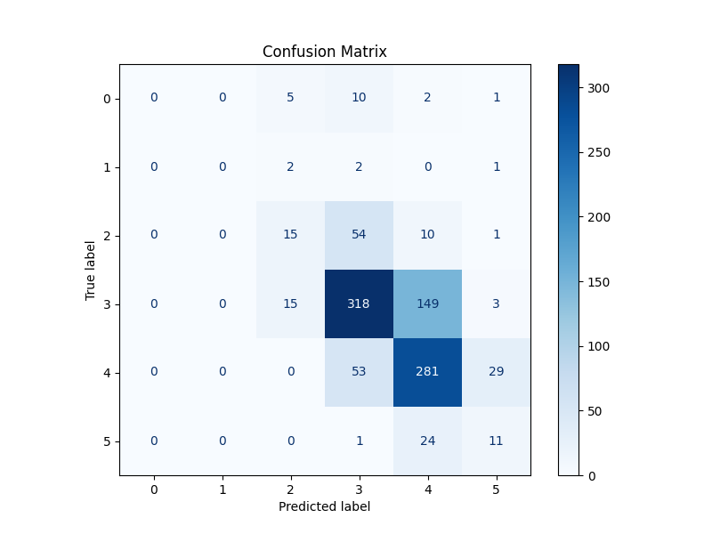
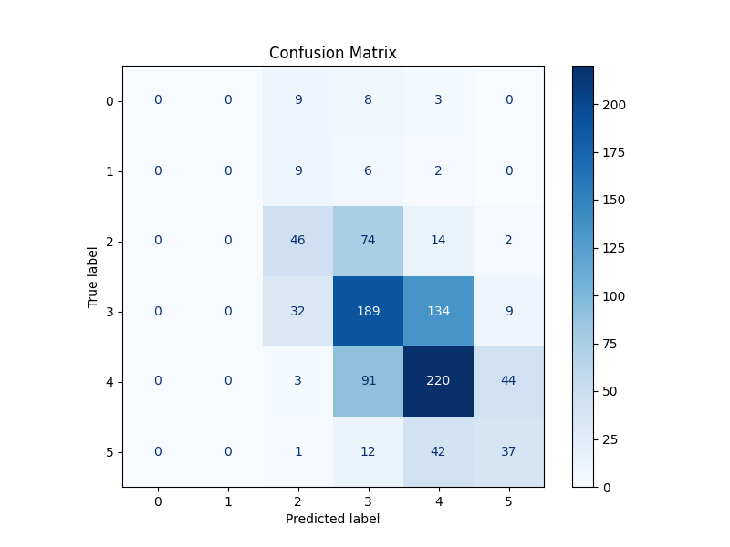
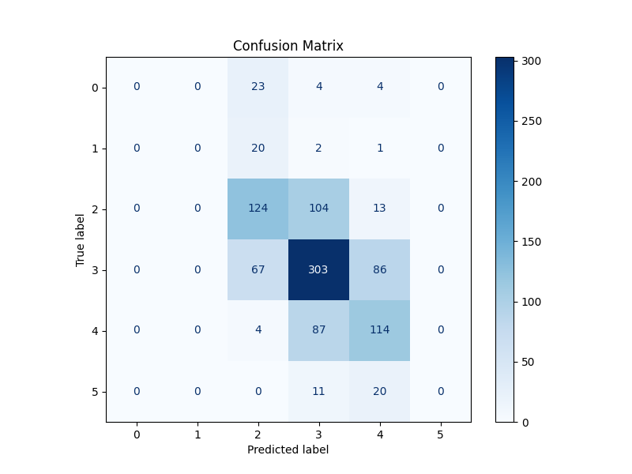
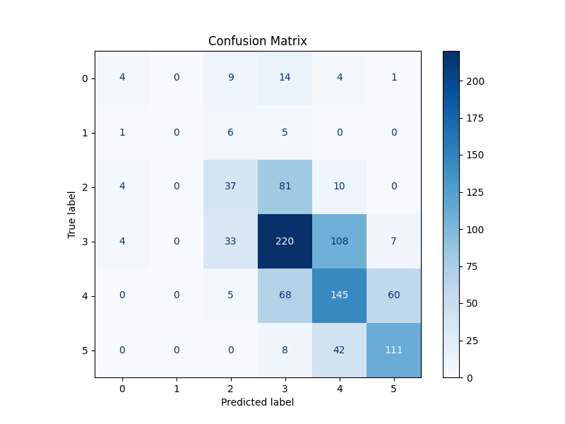
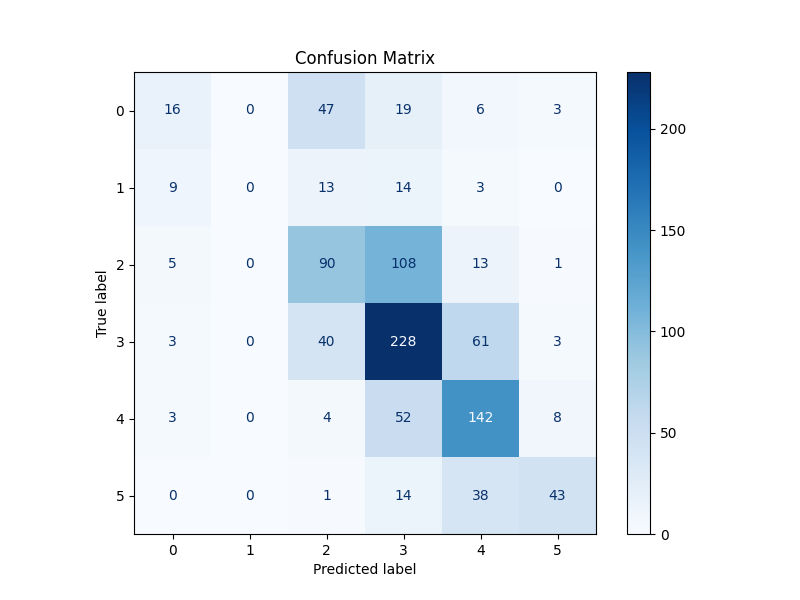
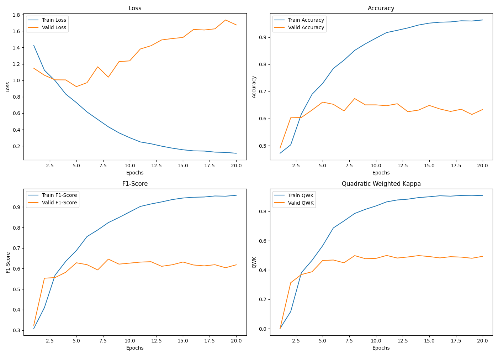
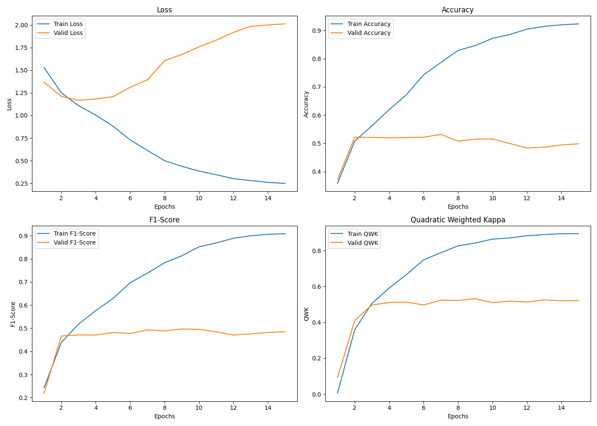
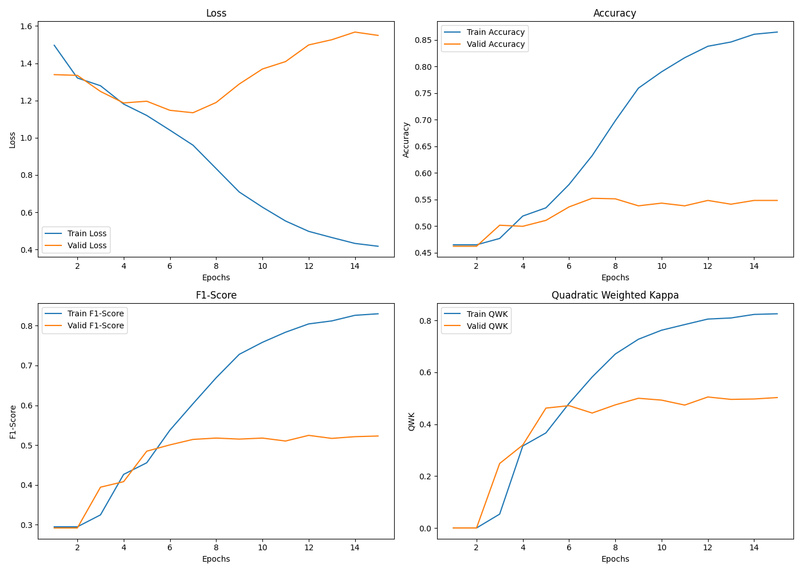
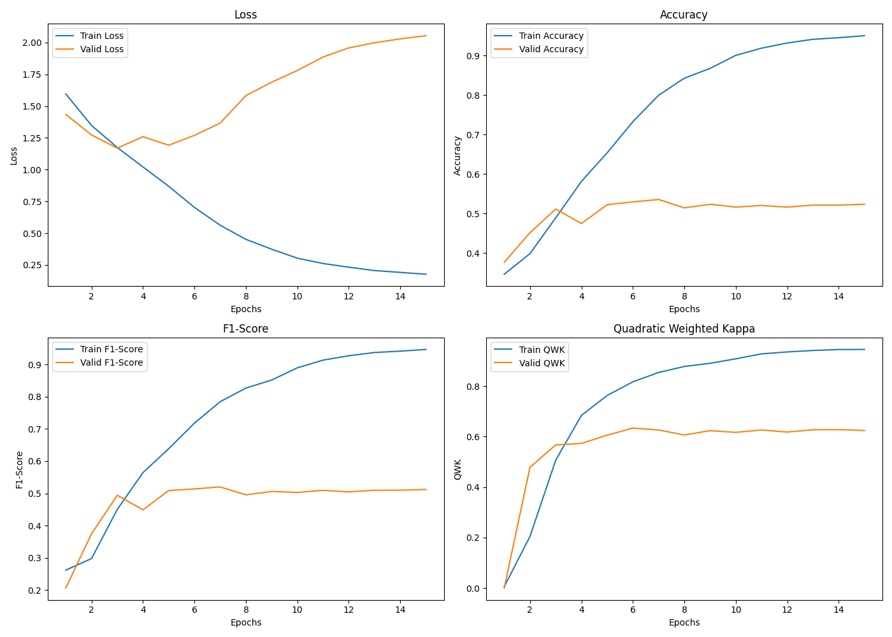
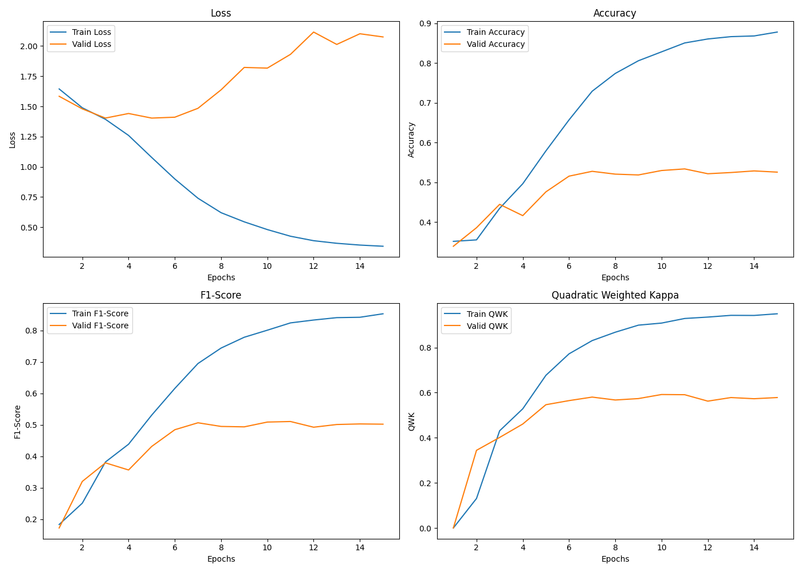

# Automatic Essay Score For ENEM

- This project realize some experiments with two models, the first is **Bert model** and last one is **GPT-4o-mini with prompt engineer**.

## Dependences
- See below what is the dependences for each model.

### Bert Model
- torch (pytorch)
- transformers (hugging face)
- sklearn
- pandas
- matplotlib

### GPT-4o-mini
- openai
- torch (pytorch)
- pandas

## Bert Model
- Make shure you have dataset Essay-BR. [Download Here](https://github.com/lplnufpi/essay-br). You need put the directory **extended-corpus** on the root of this project (into /bert-model).
- Then, open the file ``` bert-model/downstream_task_classification_C*.ipynb```, where * is the number of competência of ENEM exam.
- Change **path_dir** for the path of bert-model in your machine.
- PS: if you run in your local machine, comment the cells where have mount drive of google drive.
- Run the cells until cell "Baixando modelo Large do BertImbau". This is necessary for download weights of Bertinbau, used in this model. This will be download into bert-model/bert_data.
- And finnaly, run the .ipynb for train, validate and test the model with differents competências of ENEM exam.

## GPT-4o-mini
- Here, you need open **.ipynb** file and add your key access of your account in variable ``` api_key_openai ```. You need create your key in OpenAI API, so create this, copy and paste the key into notebook.
- After that, change ``` path_dir ``` to find where is the **extended-corpus** directory and ``` path_dir_save ``` for save your results.

## Metrics
- In this moment, we avaliate:
    - Accuracy
    - F1 Score
    - QWK (Quadratic Weighted Kappa)

## Results
- See below our results (compatition between Accuracy, F1 Score and QWK):
- PS: Accuracy-40 and QWK-40 is comparison of how much the model can predict considering a range of 40 points in the competência.

| Competência | Métrica       | Bert Model | GPT-4o-mini (prompt v1) |
|-------------|---------------|------------|-------------------------|
| **C1**      | Acurácia      | 0.6505     | 0.4184                 |
|             | Acurácia-40   | 1          | 0.924                  |
|             | QWK           | 0.5526     | 0.3316                 |
|             | QWK-40        | 1          | 0.7176                 |
|             | F1            | 0.6381     | 0.4184                 |
| **C2**      | Acurácia      | 0.5299     | 0.4863                 |
|             | Acurácia-40   | 1          | 0.924                  |
|             | QWK           | 0.5573     | 0.3939                 |
|             | QWK-40        | 1          | 0.7615                 |
|             | F1            | 0.5187     | 0.4319                 |
| **C3**      | Acurácia      | 0.5441     | 0.4316                 |
|             | Acurácia-40   | 1          | 0.8977                 |
|             | QWK           | 0.5211     | 0.3117                 |
|             | QWK-40        | 1          | 0.6126                 |
|             | F1            | 0.5211     | 0.3664                 |
| **C4**      | Acurácia      | 0.5441     | 0.3860                 |
|             | Acurácia-40   | 1          | 0.8227                 |
|             | QWK           | 0.6263     | 0.3344                 |
|             | QWK-40        | 1          | 0.6395                 |
|             | F1            | 0.5371     | 0.3162                 |
| **C5**      | Acurácia      | 0.5056     | 0.3718                 |
|             | Acurácia-40   | 1          | 0.7842                 |
|             | QWK           | 0.6135     | 0.3952                 |
|             | QWK-40        | 1          | 0.5847                 |
|             | F1            | 0.4862     | 0.3418                 |

### Confusion Matrix
- See below the confusion matrix computed using accuracy:

<div align="center">
  <div>
    <strong>Competência 1</strong><br>
    
  </div>
  <div>
    <strong>Competência 2</strong><br>
    
  </div>
  <div>
    <strong>Competência 3</strong><br>
    
  </div>
</div>

<div align="center">
  <div>
    <strong>Competência 4</strong><br>
    
  </div>
  <div>
    <strong>Competência 5</strong><br>
    
  </div>
</div>

### Metrics
- We plot the loss and results of metrics for comparison:

<div align="center">
  <div>
    <strong>Competência 1</strong><br>
    
  </div>
  <div>
    <strong>Competência 2</strong><br>
    
  </div>
  <div>
    <strong>Competência 3</strong><br>
    
  </div>
</div>

<div align="center">
  <div>
    <strong>Competência 4</strong><br>
    
  </div>
  <div>
    <strong>Competência 5</strong><br>
    
  </div>
</div>